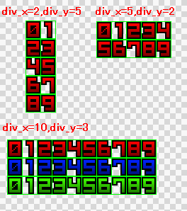

# #SRC_IMAGE

|: Property Name : |: Description  : ||
|:------------- |:-------------- |
| `gr`    |: Specifies which image index to use. See [`#IMAGE`]({{ site.baseurl }}) :||
| `x`    | Specifies the x-coordinate to start at.  | |
| `y`    | Specifies the y-coordinate to start at.  | ^^|
| `w`    | Specifies the width of the image | ^^|
| `h`    | Specifies the height of the image.  | ^^|
| `div_x`| Specifies the number of times to divide the image horizontally |  |
| `div_y`| Specifies the number of times to divide the image vertically | ^^|