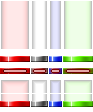
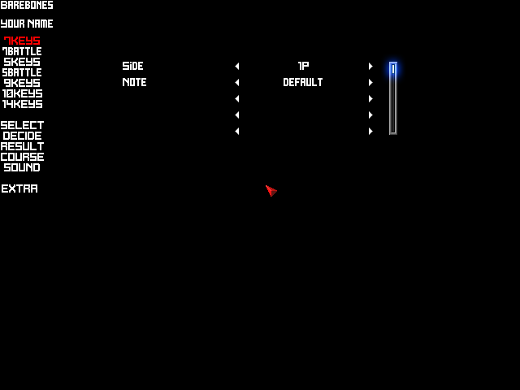
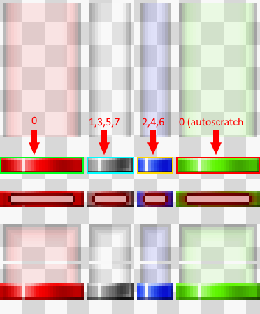
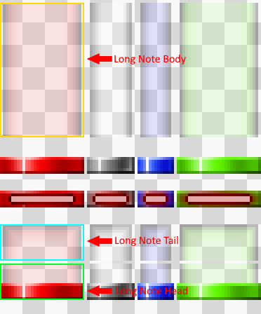
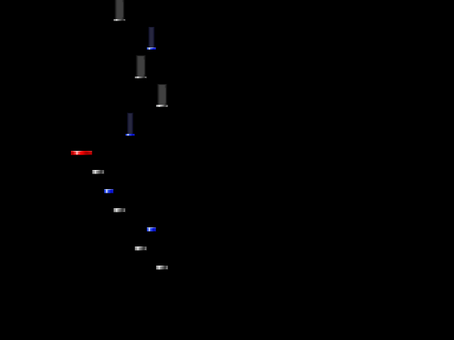
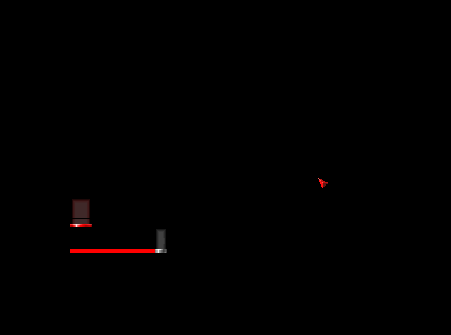

# Preface

This article will cover how to start creating a playskin from scratch. Textures will be provided but the reader is encouraged to use their own and to experiment with their own ideas. 

{: .note }
Barebones may imply minimal, but the reader will have a fully functioning playskin by the end of the article.

The following elements will be implemented:
- Bombs
- Guage/Lifebar
- Hit Lighting
- Lanecover
- Judgements & Combo
- Judgeline
- Lasers
- Noteskin

A preview of the skin can be located below:

# Outlining

Firstly, create a folder inside of `LR2Files\Theme\`. We will call our skin Barebones, so we should create the folder `LR2Files\Theme\barebones\`. 
```
📁LR2Files/
└── 📁Themes/
    └── 📁barebones/
```
Secondly we need to create a file inside of that folder with the `.lr2skin` extension. This extension is what LR2 looks for when searching the Themes directory. We will call ours `barebones.lr2skin`, though the name doesn't have to match the directory name. 
```
📁LR2Files/
└── 📁Themes/
    └── 📁barebones/
        └── 📝barebones.lr2skin
```
It is also a good idea to create directories for all of your customization options. Doing so allows you to much more easily manage each part of your skin.
```
📁LR2Files/
└── 📁Themes/
    └── 📁barebones/
        ├── 📁csv/
        ├── 📁img/
        │   ├── 📁bombs/
        │   ├── 📁guage/
        │   ├── 📁lasers/
        │   ├── 📁lanecover/
        │   ├── 📁notes/
        │   ├── 📁judgeline/
        │   ├── 📁judgements/
        │   └── 📁lighting/
        └── 📝barebones.lr2skin
```
# Creating the .lr2skin file

Inside of our `.lr2skin` file, we will use the [`#INFORMATION`]({{ site.baseurl }}) command to include some general metadata, as well as define options for customizing the skin.

{: .warning }
All paths should use backslashes `\` rather than forward slashes! Forward slashes can cause weird errors and unexpected behavior!

**barebones.lr2skin**
```
//#INFORMATION	Type	Title		Author		Thumbnail (optional)
#INFORMATION,0,Barebones,Your Name

//#CUSTOMOPTION	Title	DST_OP	Label
#CUSTOMOPTION,Side,920,1P,2P
//#CUSTOMFILE	Title	path	default
#CUSTOMFILE,Note,LR2Files\Theme\barebones\img\notes\*.png,default

#ENDOFHEADER

#IF,920
#INCLUDE,LR2Files\Theme\barebones\csv\1p.csv
```

Additionally, it would be prudent to create the csv files and textures.

## **`csv\1p.csv`**
```
#IMAGE	LR2Files\Theme\barebones\img\notes\*.png	//0

//Measure Line (currently not defined to be anything, however lr2 will crash if this is not defined)
//1P index = 0 //2P index = 1
//SRC		(NULL)	gr	x	y	w	h	div_x	div_y	cycle	timer
#SRC_LINE	0	0	0	0	0	1	1	1	0	0
//DST		(NULL)	time	x	y	w	h	acc	a	r	g	b	blend	filter	angle	center	loop	timer	op1	op2	op3
#DST_LINE	0	0	0	0	0	0	0	255	255	255	255	0	0	0	0	0	0	0	0	0
#DST_LINE	0	0	0	0	0	0	0	255	255	255	255	0	0	0	0
```

## **`img\notes\default.png`**

###### (Note textures from REMI-S AC)



Your file structure should look like this
```
📁LR2Files/
└── 📁Themes/
    └── 📁barebones/
        ├── 📁csv/
            ├── 📝1p.csv
        ├── 📁img/
        │   ├── 📁bombs/
        │   ├── 📁guage/
        │   ├── 📁lanecover/
        │   ├── 📁lasers/
        │   ├── 📁notes/
        │   │   └── 🖼️default.png
        │   ├── 📁judgeline/
        │   ├── 📁judgements/
        │   └── 📁lighting/
        └── 📝barebones.lr2skin
```

Voila! our skin appears in the LR2 skin selector.\



# Getting Notes to Display

We'll start by sourcing our normal notes.

## **`csv\1p.csv`**
```
[...]

//Notes										
//Normal Notes										
//SRC_NOTE	index	gr	x	y	w	h	div_x	div_y	cycle	timer
#SRC_NOTE	0	0	0	49	30	13	1	1	0	0
#SRC_NOTE	1	0	31	49	17	13	1	1	0	0
#SRC_NOTE	2	0	49	49	13	13	1	1	0	0
#SRC_NOTE	3	0	31	49	17	13	1	1	0	0
#SRC_NOTE	4	0	49	49	13	13	1	1	0	0
#SRC_NOTE	5	0	31	49	17	13	1	1	0	0
#SRC_NOTE	6	0	49	49	13	13	1	1	0	0
#SRC_NOTE	7	0	31	49	17	13	1	1	0	0
```


Similarly, we will define the our long notes.
## **`csv\1p.csv`**
```
//Long Note Tail										
#SRC_LN_END	0	0	0	80	30	13	1	1	0	0
#SRC_LN_END	1	0	31	80	17	13	1	1	0	0
#SRC_LN_END	2	0	49	80	13	13	1	1	0	0
#SRC_LN_END	3	0	31	80	17	13	1	1	0	0
#SRC_LN_END	4	0	49	80	13	13	1	1	0	0
#SRC_LN_END	5	0	31	80	17	13	1	1	0	0
#SRC_LN_END	6	0	49	80	13	13	1	1	0	0
#SRC_LN_END	7	0	31	80	17	13	1	1	0	0
										
//Long Note Body										
#SRC_LN_BODY	0	0	0	1	30	48	1	1	0	0
#SRC_LN_BODY	1	0	31	1	17	48	1	1	0	0
#SRC_LN_BODY	2	0	49	1	13	48	1	1	0	0
#SRC_LN_BODY	3	0	31	1	17	48	1	1	0	0
#SRC_LN_BODY	4	0	49	1	13	48	1	1	0	0
#SRC_LN_BODY	5	0	31	1	17	48	1	1	0	0
#SRC_LN_BODY	6	0	49	1	13	48	1	1	0	0
#SRC_LN_BODY	7	0	31	1	17	48	1	1	0	0
										
//Long Note Head										
#SRC_LN_START	0	0	0	94	30	13	1	1	0	0
#SRC_LN_START	1	0	31	94	17	13	1	1	0	0
#SRC_LN_START	2	0	49	94	13	13	1	1	0	0
#SRC_LN_START	3	0	31	94	17	13	1	1	0	0
#SRC_LN_START	4	0	49	94	13	13	1	1	0	0
#SRC_LN_START	5	0	31	94	17	13	1	1	0	0
#SRC_LN_START	6	0	49	94	13	13	1	1	0	0
#SRC_LN_START	7	0	31	94	17	13	1	1	0	0
```


We will do the same for mines.
## **`csv\1p.csv`**
```
//Mine										
#SRC_MINE	0	0	0	68	30	6	1	1	0	0
#SRC_MINE	1	0	31	68	17	6	1	1	0	0
#SRC_MINE	2	0	49	68	13	6	1	1	0	0
#SRC_MINE	3	0	31	68	17	6	1	1	0	0
#SRC_MINE	4	0	49	68	13	6	1	1	0	0
#SRC_MINE	5	0	31	68	17	6	1	1	0	0
#SRC_MINE	6	0	49	68	13	6	1	1	0	0
#SRC_MINE	7	0	31	68	17	6	1	1	0	0
```
And lastly we will repeat this all once more for autoscratch.
## **`csv\1p.csv`**
```
// Auto Scratch										
// Normal Notes										
//SRR_NOTES	index	gr	x	y	w	h	div_x	div_y	cycle	timer
#SRC_AUTO_NOTE	0	0	63	56	30	6	1	1	0	0
										
// Long Note Tail										
#SRC_AUTO_LN_END	0	0	63	80	30	13	1	1	0	0
										
//Long Note Body										
#SRC_AUTO_LN_BODY	0	0	63	1	30	48	1	1	0	0
										
//Long Note Head										
#SRC_AUTO_LN_START	0	0	63	94	30	13	1	1	0	0
										
//Mine										
#SRC_MINE	0	0	63	68	30	6	1	1	0	0
```
After that, we will go ahead and define the positions our notes are drawn at
```
// Note Positions																				
//DST_NOTE	index	time	x	y	w	h	acc	a	r	g	b	blend	filter	angle	center	loop	timer	op1	op2	op3
#DST_NOTE	0	0	100	350	30	13	0	255	255	255	255	0	0	0	0	0	0	0	0	0
#DST_NOTE	1	0	130	350	17	13	0	255	255	255	255	0	0	0	0	0	0	0	0	0
#DST_NOTE	2	0	147	350	13	13	0	255	255	255	255	0	0	0	0	0	0	0	0	0
#DST_NOTE	3	0	160	350	17	13	0	255	255	255	255	0	0	0	0	0	0	0	0	0
#DST_NOTE	4	0	177	350	13	13	0	255	255	255	255	0	0	0	0	0	0	0	0	0
#DST_NOTE	5	0	190	350	17	13	0	255	255	255	255	0	0	0	0	0	0	0	0	0
#DST_NOTE	6	0	207	350	13	13	0	255	255	255	255	0	0	0	0	0	0	0	0	0
#DST_NOTE	7	0	220	350	17	13	0	255	255	255	255	0	0	0	0	0	0	0	0	0
```
We now have notes drawn to the screen!


# Judgeline
The process of creating a judgeline is much simpler. First, we will create a customizable option for the judgeline in our `.lr2skin` file.

## **`barebones.lr2skin`**

```
#CUSTOMFILE,Judgeline,LR2Files/Theme/barebones/img/judgeline/*.png,red
```
Then, we will create our image texture
##### (we will use a 1x1 color for our texture, but any size works)
Lastly we will will add our image definition to our `1p.csv` file, and we will also include the judgeline definition.

## **`csv\1p.csv`**
```
#IMAGE	LR2Files\Theme\barebones\img\notes\*.png	//1

[...]

//Judgeline
//SRC_JUDGELINE	(NULL)	gr	x	y	w	h	div_x	div_y	cycle	timer
#SRC_JUDGELINE	0	1	0	0	1	1	1	1	0	0
//DST_JUDGELINE	(NULL)	time	x	y	w	h	acc	a	r	g	b	blend	filter	angle	center	loop	timer	op1	op2	op3
#DST_JUDGELINE	0	0	100	357	137	6	0	255	255	255	255	0	0	0	0	0	0	0	0	0

[...]
```

The judgeline definition should come **before** the note definition. To find the correct `xywh` values for the judgeline:
- The `x` should be the same as the first `#DST_NOTE`.
- The `y` should be the same as `#DST_NOTE y + (#DST_NOTE h/2 (round up))`.
- The `w` should be the sum of all `DSTNOTE w`.
- The `h` should be the same as the height of the note texture (our note texture is 6 pixels tall, so our height is 6 pixels).

After including those definitions, the screen should look something like this.